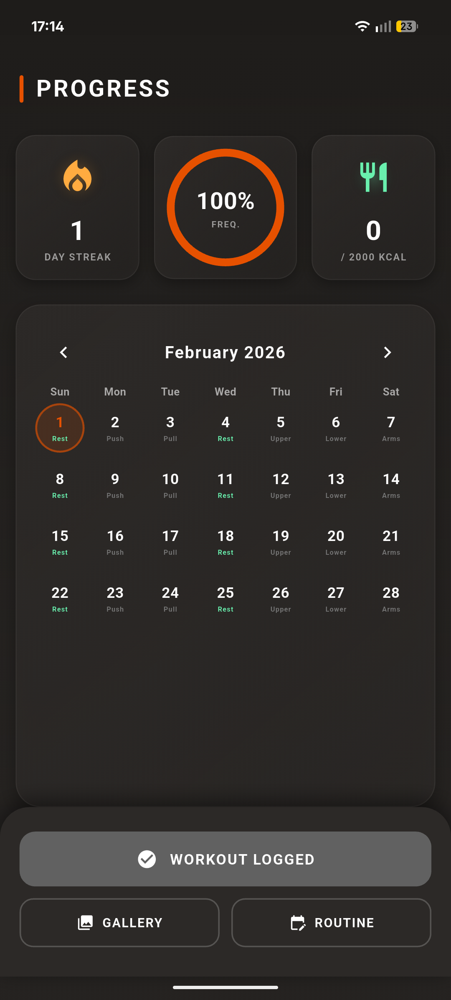
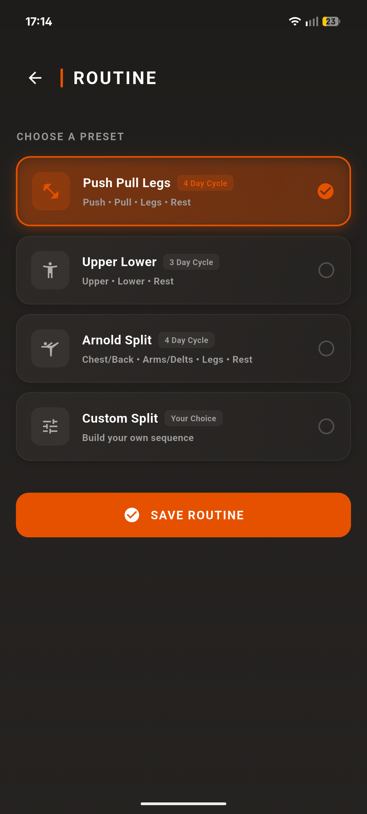
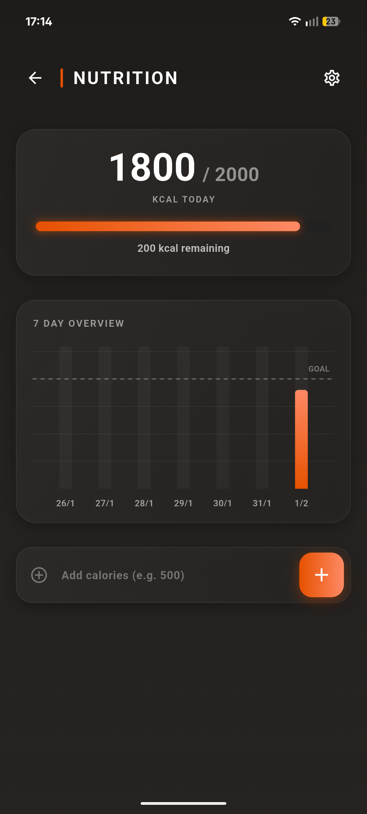
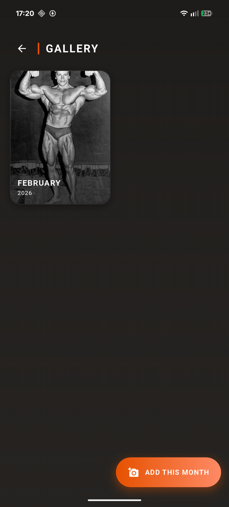

# Gym Tracker


A privacy-focused, offline-first fitness application built with Flutter. This application tracks training frequency, workout routines, daily caloric intake, and visual physique progress without relying on external servers or internet connectivity.

## Features

### 1. Dashboard & Analytics
* **Training Frequency:** Tracks workout consistency relative to the current month.
* **Streak Counter:** Gamified "fire" streak counter to encourage daily discipline.
* **Calorie Widget:** Quick-view summary of daily nutrition against a set baseline.

### 2. Workout Management
* **Interactive Calendar:** Visual history of all training days.
* **Routine Configuration:** Support for standard splits (PPL, Upper/Lower, Arnold) and fully custom workout cycles.
* **Smart Logging:** One-tap workout logging that automatically detects the correct muscle split based on your schedule.

### 3. Nutrition Tracker
* **Daily Logging:** Simple input for tracking caloric intake.
* **Data Visualization:** Weekly bar charts using `fl_chart` to visualize consistency against daily goals.
* **Custom Baselines:** User-defined daily calorie goals.

### 4. Physique Gallery
* **Progress Timeline:** Upload monthly photos to track physical changes over time.
* **Slideshow Mode:** Swipeable full-screen viewer to compare months chronologically.
* **Local Storage:** Images are stored locally on the device for maximum privacy.

---

## Screenshots

| Dashboard | Routine | Nutrition | Progress Gallery |
|:---:|:---:|:---:|:---:|
|  |  |  |  |


---

## Tech Stack

* **Framework:** [Flutter](https://flutter.dev/)
* **Language:** Dart
* **Database:** [Hive](https://pub.dev/packages/hive) (NoSQL, lightweight, local storage)
* **State Management:** `setState`
* **Key Packages:**
    * `table_calendar`: Calendar UI
    * `fl_chart`: Graphing and charting
    * `percent_indicator`: Visual progress bars
    * `image_picker` & `path_provider`: Media handling
    * `intl`: Date formatting

---

## Installation & Setup

### Prerequisites
* Flutter SDK installed.
* Android Studio / VS Code with Flutter extensions.
* **Android SDK 36** (Required for the latest `image_picker` and `path_provider` plugins).
* **NDK Version:** 27.0.12077973 (or higher).

### Steps
1.  **Clone the repository:**
    ```bash
    git clone [https://github.com/yourusername/gym-tracker.git](https://github.com/yourusername/gym-tracker.git)
    cd gym-tracker
    ```

2.  **Install dependencies:**
    ```bash
    flutter pub get
    ```

3.  **Run the app:**
    ```bash
    flutter run
    ```

### Android Build Configuration
This project uses modern plugins that require a higher Android SDK version. Ensure your `android/app/build.gradle` is configured as follows:

```gradle
android {
    compileSdk = 36
    ndkVersion = "27.0.12077973"
    // ...
}
